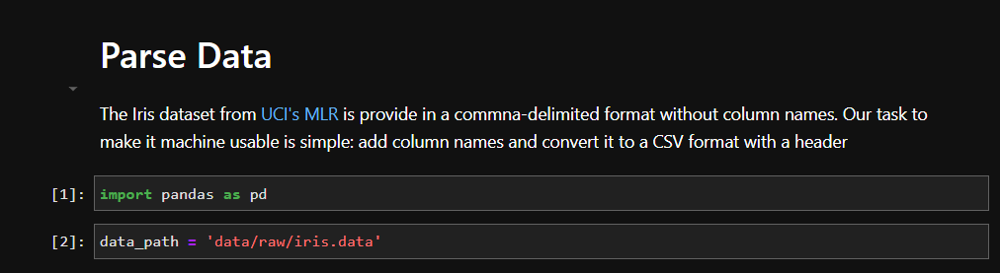
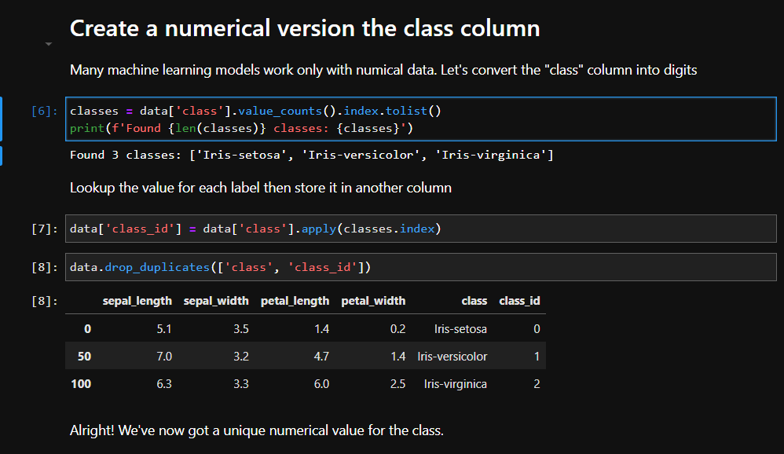

# Step-by-Step to Reproducible Data Science

The following sections are a step-by-step on how to build your project from scratch.

## Start a Git Repository

Git is a "version-control" system that lets you keep track of incremental changes in your project.
You can use git to record why you changed a specific line in a file,
create a "checkpoint" after finishing series of complicated steps in your project,
or keeping experiments you are unsure about seperate from what already works.
For your first steps, we'll detail the "create change, then record them" workflow that is 90% of what you'll use git for.

Start off by [installing Git](https://git-scm.com/) or your system, then using the command line to navigate to the folder that will be the home for your project.

Once in that folder, call `git init .`. `init` will add a new folder, `.git`, to your folder that will keep track of all of your future changes.

To start, make a file named `README.md` and type a bit about your project. `.md` files are interpreted by GitHub (and many other places) as "Markdown" files that contain formatted text. [See the Markdown tutorial](https://www.markdowntutorial.com/) to learn how to use them for your benefit.

Now that you have your first file, call `git add README.md` then `git commit` to register `README.md` and any later changes to your repository. 
Calling `git commit` will ask you for a short description about the changes you made.
"Initial commit" is the standard for your first commit, but you should be prepared to write more later.

> **Note**: `git commit` is going to open a command line text editor. See the links to `vim` and `nano` tutorials in an [earlier section](#what-do-i-expect-you-know-already)

See [GitHub's tutorial](https://docs.github.com/en/get-started/quickstart) for a more in-depth guide to git. 

## Sync your repository to GitHub

Now that your have your first commit, it is time to push it to GitHub.

Go to GitHub and [follow their directions](https://docs.github.com/en/get-started/quickstart/create-a-repo) to create a new repository.
You do not need to initialize it with anything (e.g., a `README.md`, or ignore files) as we are doing that manually as part of this tutorial.

> **Note**: If you forget and just commit things anyway, that's OK. `git` will give you instructions on how to merge your changes.

GitHub will give you some lines on how to push your existing repository up to GitHub.

## Add a Python environment

Keeping track of which versions of libraries you use is key for others to reproduce your science later.

My recommended route is to define your computational environment with an Anaconda "environment" file.
I name this file, `environment.yml`, and it looks something like the following:

```yaml
name: projname  # Memorable name for the project (no whitespace!)
channels:  # List of anaconda "channels" to search for packages. Typically just the defaults and conda-forge are necessary
  - defaults  # List "defaults" first so Anaconda tries here first
  - conda-forge 
dependencies:
  # Start with a specific version of Python (pick a newer one!)
  - python==3.9.*  #  Says any 3.9 version is OK
  
  # Put in the main libraries you may need (I always use Pandas and matplotlib)
  - pandas==1.4.*
  - matplotlib>3
  
  # Then put in development tools and Jupyter
  - jupyterlab
  - pytest
  - pip
  
   # Add packages only accessible via pip later
   - pip:
       - pytest-timeout  # Might be available on conda 🤷
  
```

A few bits of advice: 

- [*Learn YAML*.](https://www.cloudbees.com/blog/yaml-tutorial-everything-you-need-get-started) It is easy to write it "by hand" and later read it in software.
- *Specicify at least [a minor version](https://semver.org/).* I.e., list at least two numbers for major packages (3.9.* not 3.*). The minor versions will ensure you get the latest bug fixes for a package but without major changes in the API.
  - I use `matplotlib>3` above because matplotlib has changed very little over years
- *Be selective about adding new packages.* Only specify the packages you call import on, and delete ones you no longer loose. Larger environments are harder to recreate.

Once you have this environment file, try to build it:

```
conda env create --file environment.yml --force
```

Once you've done this, follow Anaconda's instructions to active your new environment and get ready to do reproducible research!

> **Note**: Rather than adding new packages to an environment using `conda install`, I typically edit the environment file and re-build the environemnt from scratch. Rebuilding it myself each time I make changes helps ensure someone else can build it later.

## Storing your raw data

You've now created a git repository, made it available on GitHub, and created your Python environment. 
The next step is to start doing science, which starts with data.

The initial part of my projects often involves two kind of :

1. *Raw Data*: Data in whatever form you are provided it. This data is to be preserved without modification, but you need to be explict about where it comes from.
1. *Cleaned Data*: Data rendered into an easy-to-use format (e.g., JSON, CSV, HDF5). It should have only the information from the Raw Data that you find useful for your science.

I place both datasets in a folder in the root directory named `data`, and put the raw data in `raw` will place the cleaned data in `clean`. 

> **Note**: See the example repository's layout for a picture on what this works.

Download your raw data into the `data/raw` folder and place a text file (in Markdown format, perhaps 🤔) in that folder describing where you got it from.


### Sidebar: How to share your data

Your raw and processed data may be too large to store in `git` on GitHub, which is best for files smaller than 10MB. If it's not, commit your data to GitHub (`git add` then `git commit`) and rest comfortably that it is accessible to tohers.

Instead, my recommendation is to place them on a data source your team can access (e.g., at a computing center, Box) for now and be prepared to publish them later. We'll talk [about publication in a later section](#some-time-later-publication).

## A first notebook: Cleaning your data

The first notebook in most of my projects is to [make](https://github.com/globus-labs/g4mp2-atomization-energy/blob/master/1_convert_data.ipynb) [data](https://github.com/globus-labs/toxicity-prediction/blob/master/admet/0_admetsar-online-datasets.ipynb) [readable](https://github.com/globus-labs/stopping-power-ml/blob/master/1_parse-qbox-data.ipynb) by Pandas.

Start off by writing a notebook that reads in your data then saves it to the `data/clean` directory in whatever format you think is best.

My recommendation is to stick to formats that are easy to use in other codes, such as JSON, CSV, or HDF5.

Once you are done with the notebook, be sure to "Restart and Run All" before saving it and commiting the notebook into your repository (i.e., `git add <your notebook>`, `git commit`).
Commit your data if it is small enough (<10 MB).

### Effective Jupyter

Jupyter is a great tool for communicating computational science but, like any tool, it takes practice to use effectively.

I write Jupyter notebooks as if I am writing a paper. 
Each notebook starts out with a title and topic sentence about what the notebook is doing. 



The rest of the notebook is a series of subsections (labeled with a header) each containing...

*a topic sentence defining what I'm going to do,...*

*a few steps of code with text explaining what the code does,..*

*and a summary statement often with a visualization showing that I did what I told you I'd do.*



I'm not perfect about following this pattern but, when I do, my notebooks are easily understood by others.

## A second notebook: performing repeatable analysis

TBD


## Some time later: Publication!

TBD
